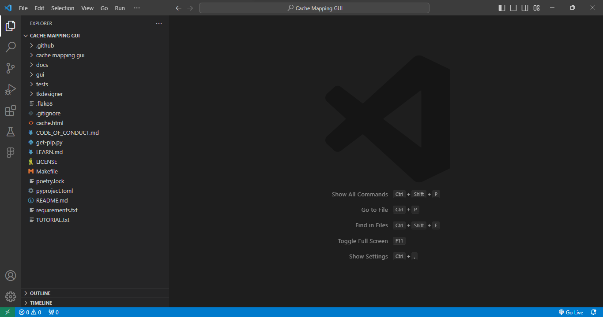
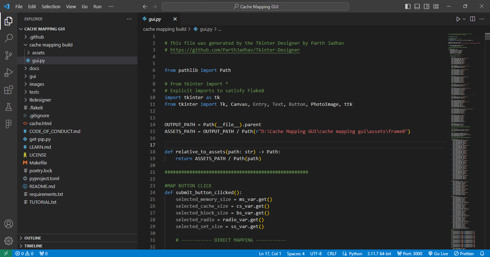
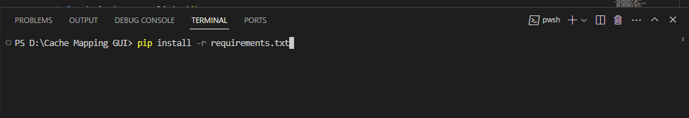
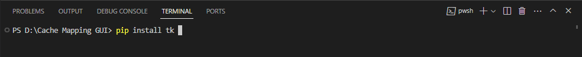
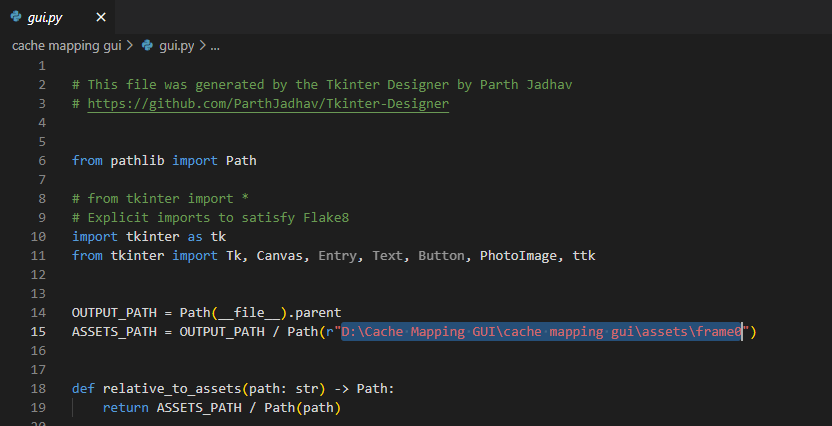
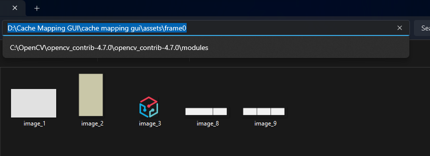
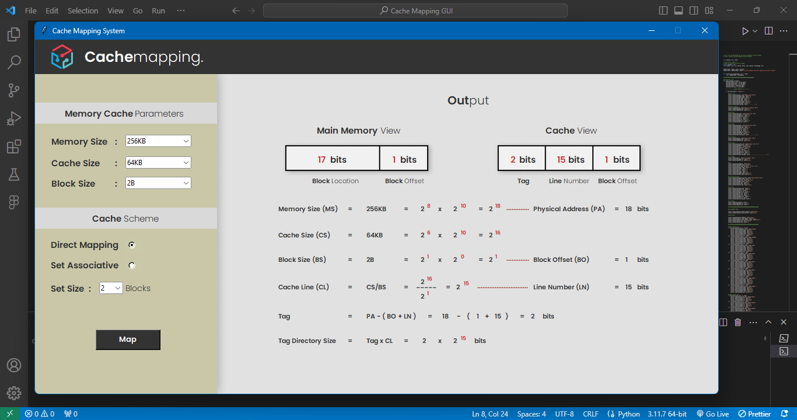

<!DOCTYPE html>

<h1>Tutorial | Cache Mapping GUI</h1>

  1. Open <strong><i>Cache Mapping GUI</i></strong> folder in Visual Studio Code
  (VS Code)

  2. Open <strong><i>gui.py</i></strong> file under
  <strong><i>cache mapping build</i></strong> folder

  3. Open Terminal and run
  <strong><i>pip install -r requirements.txt</i></strong> and
  <strong><i>pip install tk</i></strong>

4. Change the <strong>ASSETS_PATH = OUTPUT_PATH / Path(r"D:\Cache Mapping GUI\cache mapping gui\assets\frame0")</strong> with the location of frame0 in the computer

5. Run <strong><i>gui.py</i></strong> and see the output

